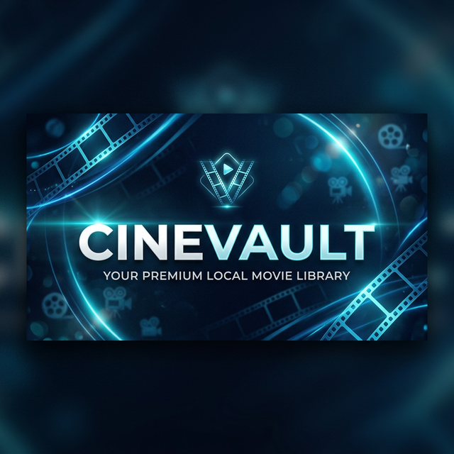

<p align="center">
  
</p>

# <p align="center">🎬 CineVault</p>

<p align="center">
  <strong>CineVault</strong> es una elegante aplicación de escritorio diseñada para convertir tu colección local de películas en una biblioteca cinematográfica de lujo.
</p>

<p align="center">
  
  
  
</p>

---

## ✨ Características Principales

*   🚀 **Escaneo Inteligente**: Detecta automáticamente archivos de video en tus carpetas locales sin mover ni copiar archivos.
*   🎬 **Identificación Automática (TMDb)**: Conexión con *The Movie Database* para descargar arte de posters, sinopsis, calificaciones y metadatos detallados.
*   🤫 **Sinopsis Propias**: Generación de resúmenes atractivos y libres de spoilers en español.
*   📽️ **Reproductor Interactivo Premium**: Visualiza tus películas con soporte para saltos (seeking), botones de 10s y atajos de teclado (Espacio, Flechas, F, Esc).
*   🧹 **Control Total de Biblioteca**: Sistema de limpieza automática al borrar carpetas y herramienta de "Limpiar Bóveda" para reseteos completos.
*   💎 **Interfaz Glassmorphic**: Estética cinematográfica con modo oscuro, animaciones fluidas y diseño responsivo.
*   🔒 **Privacidad Total**: Tu base de datos y tus rutas de archivos permanecen en tu equipo.

---

## 🚀 Tecnologías Utilizadas

*   **Frontend**: [React.js](https://reactjs.org/) + [Vite](https://vitejs.dev/)
*   **Estilos**: [Tailwind CSS](https://tailwindcss.com/) + [Lucide Icons](https://lucide.dev/)
*   **Desktop Framework**: [Electron](https://www.electronjs.org/)
*   **Base de Datos**: [SQLite3](https://sqlite.org/)
*   **API**: [The Movie Database (TMDb)](https://www.themoviedb.org/documentation/api)

---

## 🛠️ Instalación y Configuración

### Requisitos previos
*   [Node.js](https://nodejs.org/) (versión 16 o superior)
*   Una API Key de [TMDb](https://www.themoviedb.org/settings/api)

### Pasos de configuración

1.  **Clonar el repositorio**:
    ```bash
    git clone https://github.com/sanwortley/CineVault.git
    cd CineVault
    ```

2.  **Instalar dependencias**:
    ```bash
    npm install
    ```

3.  **Configurar variables de entorno**:
    Crea un archivo .env en la raíz del proyecto y añade tu clave de API:
    ```env
    TMDB_API_KEY=tu_api_key_aqui
    ```

4.  **Ejecutar en desarrollo**:
    Necesitarás dos terminales abiertas:
    
    *   **Terminal 1 (Interfaz)**:
        ```bash
        npm run dev
        ```
    *   **Terminal 2 (Aplicación)**:
        ```bash
        npm run electron
        ```

---

## 🎥 Uso

1.  Abre la aplicación y ve a la pestaña de **Ajustes**.
2.  Agrega las carpetas donde guardas tus películas.
3.  Ve a la **Biblioteca** y haz clic en **Sincronizar**.
4.  ¡Disfruta de tu colección elevada al siguiente nivel!

---

<p align="center">Desarrollado con ❤️ para amantes del cine.</p>
